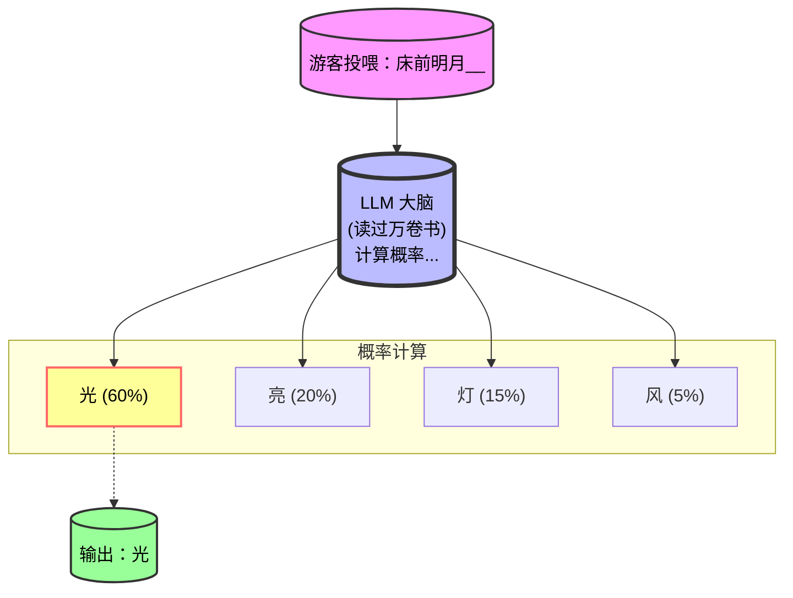

# 01. 猜词游戏：AI 是如何思考的？

> **本章目标**：读完这篇，你将明白 LLM（大语言模型）的本质，并且再也不会被各种高大上的名词（Transformer, GPT, BERT）吓倒。
>
> **核心类比**：LLM = 一个读过全世界书的“微信输入法”。

---

## 一、悬念引入：你手机里就住着个“超级大脑”

如果我说，你现在做的每一件事，都被一个看不见的“超级大脑”在暗中观察并预测，你信吗？

别紧张，这个“超级大脑”不是外星人，也不是政府监控，它可能就是你手机里的**微信输入法**。

  
🇨🇳 简体中文类比 (大陆游客区)

  
想象一下，你在微信里打字，刚输入“今天天气真”，输入法立马弹出“好”。

  
它怎么知道的？因为它读过几亿条聊天记录，知道“真”后面大概率接“好”，而不是“坏”或“棒”。

  
<strong>LLM (大语言模型) 就是把这种能力放大了 一万倍</strong>。它不仅会猜词，还会写诗、写代码、做数学题。本质上，它依然是在做<strong>“概率预测”</strong>。

  
🇹🇼 繁體中文類比 (港澳台遊客區)

  
想像一下，你在 LINE 裡打字，剛輸入「今天天氣真」，輸入法立馬跳出「好」。

  
它怎麼知道的？因為它讀過幾億條對話記錄，知道「真」後面機率最大是接「好」。

  
<strong>LLM 就是把這種能力放大了一萬倍</strong>。它不僅會猜詞，還會寫詩、寫 Code、做數學題。本質上，它依然是在做<strong>「機率預測」</strong>。

  
🇺🇸 English Analogy (International Visitors)

  
Think of the predictive text on your iPhone or Gmail. When you type "Meeting at", it suggests "3pm" or "5pm". It's not magic; it's probability based on millions of emails.

  
<strong>An LLM is just that same "autocomplete" feature, but trained on almost the entire internet</strong>, allowing it to write essays, code, and poems. It's essentially doing <strong>"probability prediction"</strong>.

---

## 二、核心概念：LLM 的“思考”过程

LLM 不是神，它是一只**“博学但爱吹牛的超级鹦鹉”**。

它不会“思考”，它只会**“计算下一个字的概率”**。

### 动态图解：LLM 是如何“造句”的？

看下面这个流程图，当 LLM 看到“床前明月__”时，它的大脑里发生了什么：

**园长（我）解读**：
1.  你给提示词 (Prompt)：“床前明月__”。
2.  LLM 根据训练数据，计算下一个字是所有汉字的概率。
3.  它选择概率最高的那个字输出：“光”。
4.  循环往复，直到生成整首诗。

**所以，LLM 的“思考” = 疯狂计算概率。**

---

## 三、实战演练：亲手喂一次“超级鹦鹉”

光看不练假把式。我们写 3 行 Python 代码，亲自体验一下“概率预测”。

  

    

      
      
      
    

    Python
  

  <pre><code>
# 这是一个简单的示例，展示如何调用 LLM
# 假设我们使用一个虚构的简单接口

import requests

def feed_parrot(prompt):
    url = "https://api.example.com/v1/chat"
    headers = {"Authorization": "Bearer YOUR_API_KEY"}
    data = {"prompt": prompt}
    
    # 发送请求
    response = requests.post(url, json=data, headers=headers)
    return response.json()['reply']

# 试试让它写诗
print(feed_parrot("床前明月"))
# 输出可能为：床前明月光，疑是地上霜...
  </code></pre>

> 💡 **园长推荐**：如果你没有 API Key，推荐去 [这里注册](YOUR_AFFILIATE_LINK_HERE) 获取免费额度，新用户送 $5，够你喂好几次！

---

## 四、避坑指南：别被它骗了！

LLM 会**“一本正经地胡说八道”**（术语叫“幻觉”）。

* **不要盲目信任**：它说“地球是平的”，不是因为它傻，是因为它训练数据里有人这么写。
* **隐私泄露**：不要把你的密码、公司机密发给它。数据一旦发出，就不再安全。
* **提示词太烂**：你问得越模糊，它答得越离谱。学会写清晰的 Prompt 是基本功。

---

## 五、悬念结尾：下一章是什么？

恭喜你已经认识了 AI 世界的“超级鹦鹉”！

但问题来了：
* 如果它只是猜下一个字，那它是怎么写出**整首诗**、**整段代码**，甚至**整本小说**的？
* 难道它不会写着写着就**跑题**吗？

答案就在下一篇：**《02. 上下文的魔法：AI 的记忆力有多好？》**

在那里，我们会揭开 LLM 的“记忆”秘密，看看它是如何做到“过目不忘”的。

---

  
🚀 系列教程进度：1/10 (10%)

  

    

  

  <a href="/docs/prompt" class="inline-block px-6 py-2 bg-blue-600 text-white rounded-full hover:bg-blue-700 transition-colors font-semibold">
    继续阅读下一章：提示词工程 →
  </a>

