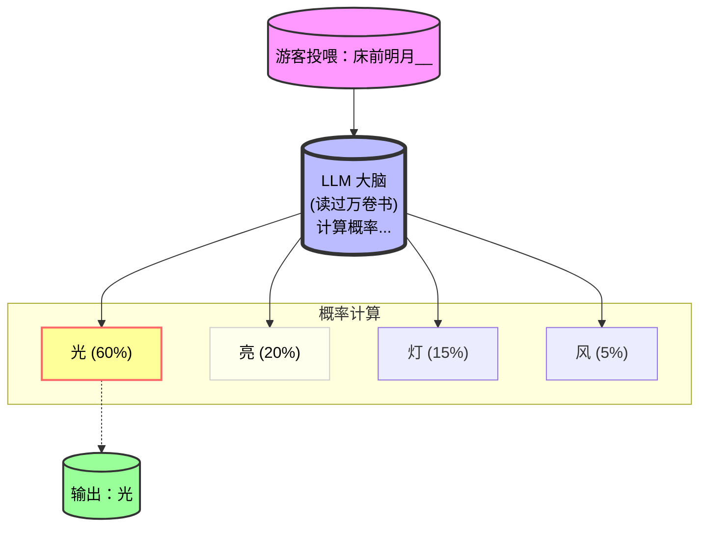

# 01 号动物：LLM (大语言模型)

> **园长寄语**：别被"大语言模型"这个词吓倒。把它想象成一只**读过全图书馆书的超级鹦鹉**。它很聪明，学舌极快，但有时候也会"一本正经地胡说八道"。

## 1. 它是什么动物？

LLM (Large Language Model) 是一种基于 Transformer 架构的深度学习模型。

### 简体中文类比 (大陆游客区)
> 想象一下你用微信打字，刚输入"今天天气真"，输入法立马弹出"好"。它怎么知道的？因为它读过几亿条聊天记录，知道"真"后面大概率接"好"。
>
> **LLM 就是把这种能力放大了 一万倍**。它不仅会猜词，还会写诗、写代码、做数学题。本质上，它依然是在做**"概率预测"**。

### 繁体中文类比 (港澳台游客区)
> 想像一下你用 LINE 打字，剛輸入"今天天氣真"，輸入法立馬跳出"好"。它怎麼知道的？因為它讀過幾億條對話記錄，知道"真"後面機率最大是接"好"。
>
> **LLM 就是把這種能力放大了一萬倍**。它不僅會猜詞，還會寫詩、寫 Code、做數學題。本質上，它依然是在做**"機率預測"**。

### 英文类比 (International Visitors)
> Think of the predictive text on your iPhone or Gmail. When you type "Meeting at", it suggests "3pm" or "5pm". It's not magic; it's probability based on millions of emails.
>
> **An LLM is just that same "autocomplete" feature, but trained on almost the entire internet**, allowing it to write essays, code, and poems. It's essentially doing **"probability prediction"**.

## 2. 动物习性图解 (Mermaid Chart)

LLM 是如何思考的？看这张"鹦鹉学舌"流程图：



**园长解读**：
1.  你给提示词 (Prompt)。
2.  LLM 根据训练数据，计算下一个字是所有汉字的概率。
3.  它选择概率最高的那个字输出。
4.  循环往复，直到生成整段话。

## 3. 饲养员实战 (Python 调用)

想不想亲手喂一次这只"超级鹦鹉"？

```python
# 这是一个简单的示例，展示如何调用 LLM
# 假设我们使用一个虚构的简单接口

import requests

def feed_parrot(prompt):
    url = "https://api.example.com/v1/chat"
    headers = {"Authorization": "Bearer YOUR_API_KEY"}
    data = {"prompt": prompt}
    
    # 发送请求
    response = requests.post(url, json=data, headers=headers)
    return response.json()['reply']

# 试试让它写诗
print(feed_parrot("床前明月"))
# 输出可能为：床前明月光，疑是地上霜...
```

> 💡 **园长推荐**：如果你没有 API Key，推荐去 [这里注册](YOUR_AFFILIATE_LINK_HERE) 获取免费额度，新用户送 $5，够你喂好几次！

## 4. 饲养员避坑指南

1.  **盲目信任**：LLM 会"一本正经地胡说八道" (幻觉)。**重要信息必须核实！**
2.  **隐私泄露**：不要把你的密码、公司机密发给它。数据一旦发出，就不再安全。
3.  **提示词太烂**：你问得越模糊，它答得越离谱。学会写清晰的 Prompt 是基本功。

## 5. 下一步：驯兽师进阶

恭喜你已经认识了 AI 动物园的明星居民！

*   想学怎么让这只鹦鹉写出更好的诗？ -> **下一篇：《提示词工程：如何让鹦鹉说人话》**
*   想看更绚丽的动物？ -> **前往：《02 号动物：Midjourney (孔雀)》**

---
*本文首发于 [AI 动物园](https://zoo.quen.us.kg)，更多 AI 动物档案，欢迎关注。*
